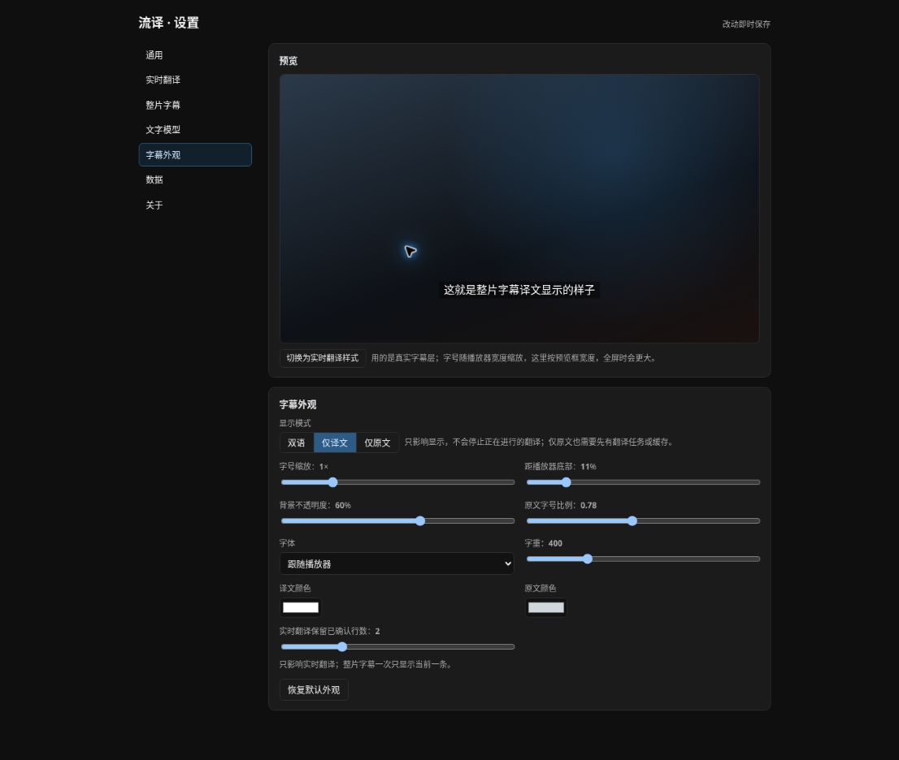
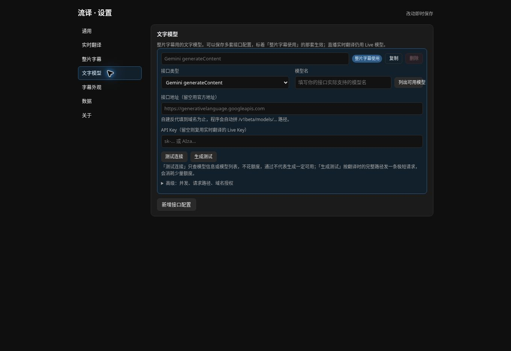
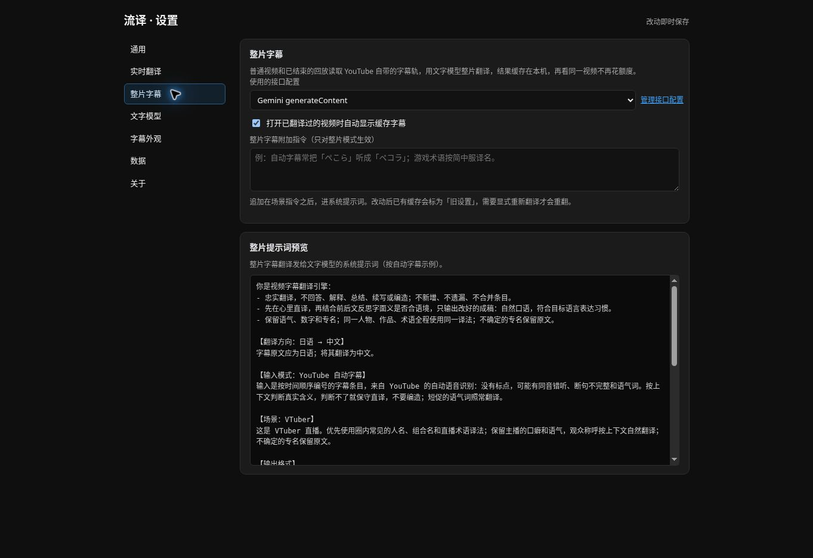

# LiveTranslate for YouTube

[English](README.md) · [简体中文](README.zh-CN.md)

Live streams: translate YouTube live audio into captions inside the player with Gemini 3.5 or Qwen 3.8 LiveTranslate, while the original audio keeps playing.
Videos and replays: read the video's own YouTube caption track, translate the whole video with a text model, cache the result locally, and start watching as soon as the part around the current position is ready.
Optional chat translation uses Chrome's local Translator API. Comments and expanded replies can be translated on demand with the subtitle text model.
Selected text can also be translated from the right-click menu or read aloud in Japanese/English with Microsoft Neural voices or Gemini TTS.

[](https://github.com/xieyuanqing/live-translate-extension/actions/workflows/check.yml)
[](LICENSE) · [Private TTS adapter: GPLv3](docs/third-party-tts.md)

**Development version 0.4.0 (unreleased).** A standalone Chrome Manifest V3 extension. The current interface is in Simplified Chinese. Install it manually for now; it is not listed in a browser extension store.

Settings and the popup share light and soft neutral-gray dark themes. Choose system appearance (default), light, or dark under Settings → 通用 → 界面外观; the popup also has a theme button. The popup has a fixed 420 px width, rounded groups, blue actions, and switches. Language choices come first; connection/audio details appear while translation runs.

## Screenshots

These screenshots show an earlier built-in offline preview with empty credentials and no cached subtitles; they do not yet show the latest chat/comment controls.

### Caption appearance



### Text model configuration



### Whole-video subtitles



## What it does

**Live streams (audio translation)**

- Captures audio from the YouTube player and sends it to the selected Gemini or Qwen live-translation model.
- Shows translated captions inside the player, including fullscreen and theater mode.
- Can start automatically on live streams, with a manual start/stop button and an `Alt+T` shortcut.
- Lets you choose source and target languages. Live translation uses its base rules and stream-specific background/terms, without a scene-template selector; reusable scene preferences remain under advanced whole-video settings.
- Can ask the configured text model once before a live session to condense the title and description into background and up to 12 candidate terms. Gemini receives that context in its prompt; Qwen receives only the term mappings supported by its live API. This is experimental and does not guarantee better accuracy.
- Open **本场提示词与术语** in the popup to inspect and copy the generator input, generated background/terms, and the frozen Gemini prompt or Qwen translation configuration. **生成并预览** works before audio capture; the next start reuses the preview if its inputs are unchanged. Disable automatic start or stop the current session first to test this workflow. Terms prioritize streamer names, documented readings, and relevant names over generic vocabulary.
- Pauses audio submission while the player is paused, muted, or showing a detected advertisement.
- Optional local live-session logs: basic mode records connection changes and timing; detailed debug mode also records metadata, the actual prompt, source transcription, and translation fragments for later comparison. Export one session or all sessions as JSON from **设置 → 数据**.
- Detailed saved sessions also have a **提示词** viewer in **设置 → 数据**. New logs include the generator input, player position, Qwen output identifiers, socket close reasons, and sent/queued/dropped audio counts. Captured audio counts alone do not prove delivery to the server.

**Videos and replays (whole-video subtitles)**

- Reads the video's caption track: a manual track in the selected source language first, then the auto-generated track. YouTube's auto-translated tracks are never used.
- Regroups auto-generated captions into complete semantic units using word timings before translating. The program owns the timeline; the model only sees numbered lines.
- Translates from the current playback position outward: the block you are watching comes first, then later blocks, then earlier ones. Seeking into an untranslated area raises its priority.
- Caches the source text and translations per video. Reopening a video shows them automatically, and an interrupted run resumes where it stopped.
- Never silently retranslates after you change the model or prompt: the old cache stays in use and is labeled; only **重新翻译** spends credits again.
- AI context generation and whole-video subtitle translation independently select a text-model configuration. Both support OpenAI-compatible `chat/completions` endpoints (the default for new configurations) and Gemini `generateContent`, with model names you type in.

**YouTube chat, comments, and replies**

- Independent switches, off by default, are available in the popup and **设置 → 弹幕与评论**. Neither feature requires starting audio or whole-video subtitle translation.
- **译文样式** offers 12 presets with dark/light previews and accent colors, independently saved for comments and chat. Changing appearance updates existing results without another translation request and keeps hidden comment translations collapsed. Plain text remains the default.
- Comment text follows the actual source color, including attributed-string inner nodes. Actions and status text remain readable in both YouTube themes; switching the page theme changes appearance without another translation request.
- Chat translates new visible text messages locally with Chrome's Translator API. Translations appear directly below the original inside the same message, using its font size and color, including paid messages and membership messages. On first use, click **准备本地翻译** in YouTube's chat area to prepare language packs. Automatic source detection also uses Chrome's Language Detector. Unsupported browsers or language pairs show an error.
- Emoji-only/image-emote messages, numeric-only spam, and short reactions such as `www`, `草`, `888888`, KAWAII, LOL, NT, NICE, and GG are skipped before translation. Matching accepts case/full-width variants and combinations with punctuation or emoji; normal sentences containing these words still translate. Custom image-emote names and hover-tooltip labels are excluded from translation; original images remain visible.
- Comments have a **翻译** button below each text comment, including expanded replies. **翻译当前可见评论** translates only already-loaded comments in the viewport. It uses **字幕翻译模型** and preserves the original. Translations follow the original as plain text with matching typography and preserved line breaks, outside YouTube's collapsed-text container. Small actions below the translation let you retranslate or hide/show it. **停止评论翻译** cancels pending work.
- Comment requests may include the parent comment, enabled video background, and terminology already prepared on the same page. No separate AI context request is made for comments. Results are reused only in page memory.

The two subtitle modes share the caption layer and settings. Qwen 3.8 detects the source language automatically and uses the selected target language; it cannot use the free-form scene prompt. Pages that are currently live use the audio mode; ordinary videos and finished replays use whole-video subtitles. A transcription model that does not depend on YouTube's auto captions is deferred until there is a way to obtain the full audio.

**Selected text and reading aloud**

- Select a word or sentence, then right-click → **流译：翻译与朗读**. A panel beside the selection shows the original and its translation using the configured subtitle text model/target language. Click **播放原文** to hear it; opening the panel does not automatically speak.
- Reading supports only Japanese and English. After ignoring spaces, punctuation, numbers, and emoji, Latin-only letters use English; everything else uses Japanese. Thus `Tokyo` uses English and `東京` uses Japanese. There is no name/pronunciation dictionary.
- Microsoft is the default and requires no customer API key. Japanese starts with Nanami; English starts with Jenny. **设置 → 朗读** offers separate voice choices, slow/normal/fast playback, and previews in both languages. This consumer service is an experimental dependency and can become unavailable.
- Gemini TTS is the second provider: reuse an existing Gemini key or enter a separate key, choose a TTS model/voice, and authorize a custom endpoint if needed. The model field starts with `gemini-3.1-flash-tts-preview` and accepts newer supported models. Actual free quota and access depend on the AI Studio project.
- The floating panel offers stop, replay, provider switching, translation, and copy. Closing it, navigating, or starting a new reading stops the previous task, including pending synthesis. Replay reuses a small temporary audio cache. Each selection is limited to 4,000 characters. Injection occurs only after a menu action; an unsupported frame can show the panel beside its iframe in the same tab. No extra page/window is opened. Browser-internal pages may prohibit injection.

## Install

1. For this development version, use a locally built `live-translate-extension-0.4.0.zip`, or load this checkout directly. [Releases](https://github.com/xieyuanqing/live-translate-extension/releases/latest) contains published versions; 0.4.0 has not been published yet.
2. Extract it into a permanent folder. Keep that folder after installation.
3. Open `chrome://extensions/` and turn on **Developer mode**.
4. Choose **Load unpacked** and select the extracted folder containing `manifest.json`.
5. Refresh any YouTube pages that were already open.

To install from source, clone this repository and load its root directory. No build step, Node.js installation, or Android tools are needed to use the extension.

For updates, replace the files in the same installation folder, reload the extension on `chrome://extensions/`, and refresh YouTube. Keeping the same installation path helps preserve the extension's local settings. A store installation or a different unpacked path may use a different extension ID; local settings are not automatically migrated.

## First-time setup

1. Open the extension popup and select **设置** (Settings).
2. Under **实时翻译**, keep the default Gemini 3.5 model and enter your [Google AI Studio key](https://aistudio.google.com/apikey), or select Qwen 3.8 and enter your Bailian workspace host and its API key. Qwen also needs the **授权千问连接** button in Settings: Chrome asks for optional “all sites” access because WebSocket authentication requires a request header. The extension scopes its temporary header rule to the current YouTube tab and exact Qwen URL, then removes it after the handshake.
3. Make sure your browser can reach the selected service. Gemini can use a compatible WSS proxy in Settings; Qwen currently supports only the specified Bailian workspace hosts.
4. Open **文字模型** in Settings and configure your endpoints. New configurations default to OpenAI-compatible `chat/completions`: enter the service's base URL (often ending in `/v1`), key, and model name. Select **AI 整理模型** and **字幕翻译模型** independently; you can copy a configuration and choose a small model for context and a stronger one for subtitles. Existing configurations retain their API type; Gemini reuses the Gemini Live key unless you enter a separate one. Model names start empty: use **列出可用模型** to pick one your account can access. **测试连接** only queries model metadata and costs nothing (passing does not prove generation works); **生成测试** sends one tiny request through the real translation path and uses a small amount of quota.
5. Choose a translation direction. The default is **Japanese → Chinese**.
6. Open a YouTube live stream. Automatic start is enabled by default once the selected model has a key; you can turn it off in Settings. To use the optional per-stream background generator, configure a working **文字模型** endpoint and enable title/description context.
7. Optionally enable chat or comments in **弹幕与评论**. Prepare local translation in YouTube's chat area when prompted; for comments, select a working subtitle text model and click a comment's translation button.
8. For reading, open **朗读** and try the Japanese/English preview. Microsoft works without a customer key. Gemini TTS requires a Gemini key with access to the selected TTS model.

Live streams use `gemini-3.5-live-translate-preview` by default or `qwen3.8-livetranslate-flash-realtime` when selected. Model availability and API charges depend on your provider account. The background generator uses its independently selected text model once per live start. Its deadline defaults to 60 seconds and can be set to 30, 60, or 120 seconds in **实时翻译 → AI 整理**, covering connection, model waiting, and the complete answer; a matching pre-start preview is reused without another request. Failure falls back to the basic Gemini prompt or Qwen without generated terms. Installing this extension does not include API credits.

## Everyday controls

| Control | Behavior |
| --- | --- |
| Start / stop live translation, or `Alt+T` | Controls audio translation in the current tab; original audio keeps playing. |
| 翻译整片字幕 | Shown on non-live video pages. Reads the caption track, translates from the current position first, and caches the result. |
| 取消翻译 / 隐藏字幕 / 重新翻译 | Cancel drops only in-flight requests and keeps finished blocks; hide keeps the cache; retranslate spends credits again. |
| 听什么 / 翻译成 | Selects the shared source and target language for subtitles, chat, and comments. |
| 聊天翻译 / 评论翻译 | Independent switches; chat is automatic and comments are translated on demand. |
| 翻译当前可见评论 / 停止评论翻译 | Translates loaded comments in the viewport or cancels pending comment work. |
| Right-click → 翻译与朗读 | Shows original/translation beside the selection; click playback to read it in Japanese/English. |
| Settings → 朗读 | Selects Microsoft/Gemini, voices, model, key, default speed, and previews. |
| 本场提示词与术语 | Combines temporary notes, AI context generation, and inspection of the actual frozen live prompt or Qwen terms. |
| 本场补充 | Inside the context viewer; adds temporary background for this video or input for Qwen term generation. It is cleared when you change videos or reload the page. |
| 应用当前设置并重新开始 | Restarts live translation with your updated language and background/terms. |
| Settings → 整片字幕 → 高级 | Manages reusable scene preferences used only for whole-video subtitle translation. |
| Settings → 字幕外观 | Display mode (bilingual, translation only, original only), translation position, size, position, background, font, and colors apply immediately, with a live preview. |
| Settings → 数据 | Controls live diagnostic logging and exports or deletes logs; manages subtitle caches, settings backups, and reset. |

Each session freezes its translation configuration. Reconnecting or rotating a connection keeps that snapshot; editing settings takes effect when you start a new session. Temporary notes are sent to the page as you type, so closing the popup does not discard the input.

While whole-video subtitles are being translated, the player shows the progress and how far from the current position is already watchable. Closing the popup does not affect the task. Changing videos, reloading, or closing the tab cancels unfinished requests; finished blocks are already saved, and **继续翻译** resumes from there.

Complete cached subtitles can be loaded without an API key. The popup displays the cache's actual target language. If translation settings change, complete and partial caches remain available; restore the original settings to resume a partial cache, or explicitly retranslate with the new settings. Requests time out after two minutes instead of waiting indefinitely. On replay pages, inactive live statistics are hidden to keep the popup compact.

Scene prompts are reusable whole-video translation preferences. Live Gemini prompts combine the fixed translation rules with the stream's generated or original background; Qwen receives its target language and term mappings. Persistent and temporary notes are also inputs to the optional context generator, with temporary notes belonging only to the current video.

## Data and credentials

There is no project-operated backend. **Audio, subtitle, and comment model requests use cloud services:** live audio goes to the selected Gemini or Qwen service; caption text and enabled background information go to the configured text-model endpoint, directly or through its configured proxy. When the background generator is enabled, the selected text model also receives the live video's metadata and notes once before the session. Gemini receives the resulting background in its live prompt; Qwen receives term mappings only.

Chat translation runs locally through Chrome; the extension does not send chat text to a text-model endpoint. Chrome may download its models and language packs. Comment translation sends the selected comment text, the parent comment for replies, and enabled background/terms to the selected subtitle model. Chat and comment results remain in page memory and are not written into the subtitle cache or live-session logs.

Selection translation sends the selected text to the subtitle text-model endpoint. Clicking playback sends it to the selected Microsoft/Gemini speech service. Text/results stay in page memory, and at most three synthesized clips are cached in worker memory, valid for replay for ten minutes; no audio file is saved by default. Gemini TTS keys are stored without application-level encryption like other keys; settings exports exclude them unless you explicitly include keys. Reading uses a separate extension player and does not change the YouTube audio graph.

The API key, preferences, scene prompts, and persistent notes are stored in `chrome.storage.local`. The key is currently stored **without application-level encryption**. Temporary notes and live captions stay in page memory **unless detailed debug logging is enabled**; that mode persists the metadata, notes, prompt, source transcription, and translations locally until deleted or rotated out. Logging is off by default. Basic logs omit speech and prompt content. Logs do not store raw audio and redact configured API keys; review an exported file before sharing it. Each session keeps at most 3,000 events and only the latest 20 completed sessions are retained. **Whole-video subtitles, both source text and translations, are persisted in the extension's local storage.** They do not expire automatically and can be deleted from Settings.

Use your own key on a computer you trust. Do not put keys in source code, issues, screenshots, or release packages. A custom proxy or third-party endpoint receives the requests routed through it, including the API key. Each provider's handling of submitted data is governed by its own terms; this project cannot promise that a provider never retains data.

Public store distribution, including its consent flow and privacy disclosures, will be handled separately.

## Troubleshooting

| Symptom | Try this |
| --- | --- |
| The popup says the page is not connected | Refresh YouTube after installing or reloading the extension. The popup also provides a refresh button. |
| It cannot connect to Gemini | Check your key, model access, network, and configured proxy. |
| It cannot connect to Qwen | Check the workspace host, API key, **授权千问连接** permission, and network. Qwen 3.8 currently cannot receive free-form prompts and does not support Traditional Chinese as a target in this extension. |
| Connected, but no captions | Play spoken audio, unmute the player, and check the input-level bar in the popup. Silence alone does not mean the connection failed. |
| "No caption track" for a video | The video has no captions, or auto captions are not generated yet. Setting 听什么 to auto-detect relaxes track selection. |
| The caption endpoint returned no usable content | YouTube's caption endpoint requires the player's own validation parameters. The error names the paths that were tried; `await LT.debug.probeCaptions()` in the content-script console shows the full log. Turn CC on once in the player and retry; if it still fails, the endpoint may have changed. |
| The text model returns 404 / 401 | Check the model name, whether the base URL ends at `/v1`, and whether the key can access that model. |
| A third-party endpoint reports CORS or "not authorized" | Use **授权浏览器访问该域名** in Settings; requests are then relayed through the extension's background worker. |
| Chat asks to prepare translation, or reports an unsupported API | Click **准备本地翻译** inside the chat area. Use a desktop Chrome with Translator support; selecting a specific source language avoids requiring Language Detector. |
| No comment translation buttons or no visible comments to translate | Enable comment translation, scroll to the comment area, and expand the replies you want. Comments not yet loaded are not fetched. |
| Reading fails or has no sound | Try the Japanese/English preview under 朗读. Check the browser volume/network; for Gemini, check the key, TTS model and domain permission. You can manually switch providers. |
| Captions overlap YouTube CC | Turn off YouTube CC or adjust the caption bottom position in Settings. |
| The popup shows a compatibility audio mode | AudioWorklet was unavailable and the extension is using ScriptProcessor as a fallback. Heavy page activity may affect capture. |

The implementation rotates Gemini connections every 505 seconds by default and Qwen connections every 120 seconds, and reconnects after interruptions. A brief reconnection message can be normal. If a problem persists, [open an issue](https://github.com/xieyuanqing/live-translate-extension/issues) with your Chrome version, extension version, and steps to reproduce. Remove credentials and private background notes from logs.

## Current limits

- Chrome is the tested browser. Other Chromium browsers and their stores have not been validated.
- The 0.4.0 test package also adds selection translation and Japanese/English reading. Syntax, self-tests, simulated regressions, and desktop/narrow-screen UI checks pass. Microsoft Japanese/English synthesis and extension audio playback were tested against the real service in an isolated Chromium profile. Gemini requests/playback and selection translation were tested with network substitutes; real Gemini TTS access and listening quality remain unverified. Comment/chat checks use simulated YouTube DOM/models; actual Chrome language-pack downloads and current YouTube integration still require user testing.
- Fast chat can outpace local translation: only visible text messages are queued, at most 30, and outdated messages are skipped. Pure emoji and messages over 2,000 characters are skipped. Comment batches are limited to eight entries and 6,000 source characters; a failed batch stops pending work for manual retry.
- Standard picture-in-picture does not include the extension's DOM caption layer.
- Live translation can lag, miss speech, or mistranslate names. It is an aid to understanding, not publication-ready subtitles.
- Generated background and terminology are hypotheses based on metadata, not verified speech recognition. In earlier short samples, generated prompts did not consistently improve accuracy. Qwen's live API accepts terminology pairs but not a free-form system prompt; repeated speech has also triggered a server-side interruption in an experiment.
- Whole-video subtitles start from YouTube's caption track. Words that the auto captions already misheard can only be guessed from context during translation, not reliably corrected.
- Reading caption tracks relies on undocumented YouTube endpoints and player behavior; server-side changes can break it.
- The current preview-model setup includes `systemInstruction` behavior observed in project testing. Treat it as an experimental dependency; future service changes may affect it.
- Context prompts are best-effort guidance, not a guarantee that a model will ignore all instructions embedded in source material.
- A long live-stream soak test across rotations, and an end-to-end browser test of whole-video subtitles with a real model, are still outstanding.

## Development

Use **Node.js 22 or later**. There are no npm dependencies to install.

```sh
npm run check
npm run package
```

`check` runs JavaScript syntax checks, version consistency, self-tests (audio, live captions, prompts, json3 parsing, segmentation, chunk validation, playback scheduling), session lifecycle, live-log redaction and retention, Qwen protocol/authentication, whole-video subtitle tasks, and selection/TTS cancellation, language, formats and resource cleanup. `package` creates `dist/live-translate-extension-0.4.0.zip` with `manifest.json` at its root and only the runtime files.

The same checks and package verification run in GitHub Actions. Automated tests simulate browser callbacks, WebSockets, caption tracks, and model responses; they do not exercise real Gemini access, live audio capture, or YouTube's caption endpoint.

See [development notes](docs/development.md) for the file layout, protocol setup, and invariants. Keep changes focused and include a regression case when fixing a reproducible bug.

## History and license

This extension was extracted from the browser-extension branch of [LiveTranslate for Android](https://github.com/xieyuanqing/vtuber-live-translate). It now has its own codebase, checks, documentation, and releases. The Android project is not needed to build or run it.

This repository starts with a fresh Git history. The original browser work is available on [`feat/chrome-extension`](https://github.com/xieyuanqing/vtuber-live-translate/tree/feat/chrome-extension); the standalone baseline includes the 0.1.1 stability and popup improvements.

See [CHANGELOG.md](CHANGELOG.md) for release notes. The original core retains the [MIT License](LICENSE). This development version contains a Microsoft TTS adapter derived from Read Frog under GPLv3, with its source attribution and license retained. The adapter source and its GPLv3 license are included in this repository. See [third-party provenance](docs/third-party-tts.md); the current package is not represented as entirely MIT.
